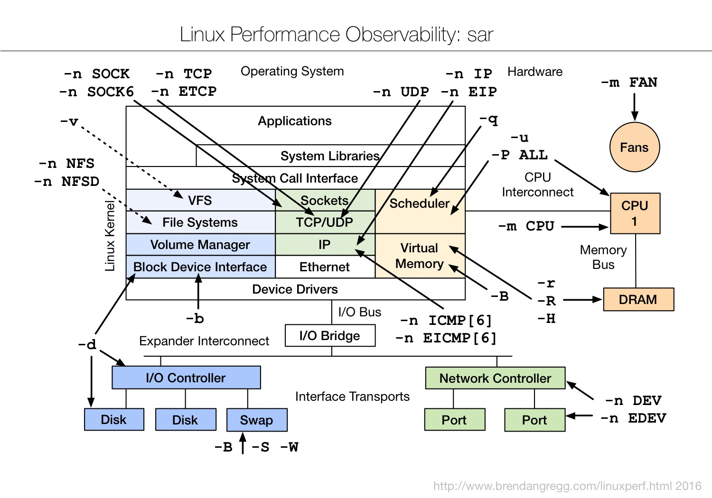

# 查看网速

```
ethtool eth0 | grep -i Speed
        Speed: 1000Mb/s
        
apt install sysstat
sar -n DEV  1

11:48:54        IFACE   rxpck/s   txpck/s    rxkB/s    txkB/s   rxcmp/s   txcmp/s  rxmcst/s
11:48:54         eth0     17.07     12.20      1.23      1.86      0.00      0.00      0.00
11:48:54           lo      0.00      0.00      0.00      0.00      0.00      0.00      0.00

Average:        IFACE   rxpck/s   txpck/s    rxkB/s    txkB/s   rxcmp/s   txcmp/s  rxmcst/s
Average:         eth0     20.91     22.80      3.67     18.55      0.00      0.00      0.00
Average:           lo      1.49      1.49      0.39      0.39      0.00      0.00      0.00

```



# ss

> Another utility to investigate sockets

## 基本用法

```
ss -t -a
      Display all TCP sockets.

ss -u -a
      Display all UDP sockets.

ss -o state established '( dport = :ssh or sport = :ssh )'
      Display all established ssh connections.

ss -x src /tmp/.X11-unix/*
      Find all local processes connected to X server.

ss -o state fin-wait-1 '( sport = :http or sport = :https )' dst 193.233.7/24
      List all the tcp sockets in state FIN-WAIT-1 for our apache to network 193.233.7/24 and look at their timers.
```

## `ss -i` 详解

```
Netid  State      Recv-Q Send-Q   Local Address:Port       Peer Address:Port
ESTAB       0      0 ::ffff:127.0.0.1:2181 ::ffff:127.0.0.1:52150
cubic wscale:6,7 rto:204 rtt:7.5/3 ato:40 mss:21888 cwnd:10 ssthresh:7 send 233.5Mbps rcv_rtt:22200.7 rcv_space:43690
```

- Recv-Q，The count of bytes not copied by the user program connected to this socket.
- Send-Q，The count of bytes not acknowledged by the remote host.
- cubic，TCP 拥塞控制使用的算法，通过 `/proc/sys/net/ipv4/tcp_congestion_control` 设置
- wscale，rwnd 的 scale 值，逗号前面的 6 对远端提供的 rwnd 起作用，逗号后面的 7 对我们提供给远端的 rwnd 起作用。`/proc/sys/net/ipv4/tcp_window_scaling` 控制是否开启 scale
- rto，Retransmittion Timeout，204ms 内没收到 ack，理论上最小为1s，但 Linux 实现中默认一般小于1s，见参考5。 `netstat -s | grep retrans` 可以看到重传数
- rtt，Round Trip Time (is the delays between sent packets and received ACK)
- cwnd，current congestion window size
- ssthresh，a system-configured congestion threshold。在 tcp 慢启动阶段，cwnd <= ssthresh 。在 `/sys/module/tcp_cubic/parameters/initial_ssthresh` 中设置，默认为 0.
- rcv_rtt，The time to receive one full window
- rcv_space，twice the most recently measured window? TCP's internal auto-tuning to grow socket buffers based on how much data the kernel estimates the sender can send

### 参考：

1. http://www.misterx.org/wiki/index.php/Ss
2. https://github.com/jiacai2050/ideas/issues/41#issuecomment-362791333
3. [What is rcv_space in the 'ss --info' output, and why it's value is larger than net.core.rmem_max](https://access.redhat.com/discussions/782343)
4. https://blog.janestreet.com/inspecting-internal-tcp-state-on-linux/
5. [Performance Best Practice: Monitor TCP Retransmits](https://www.ibm.com/developerworks/community/blogs/kevgrig/entry/Best_Practice_Monitor_TCP_Retransmits?lang=en)
6. http://www.lognormal.com/blog/2012/09/27/linux-tcpip-tuning/

## ss 源码

- https://git.kernel.org/pub/scm/network/iproute2/iproute2.git/tree/misc/ss.c
